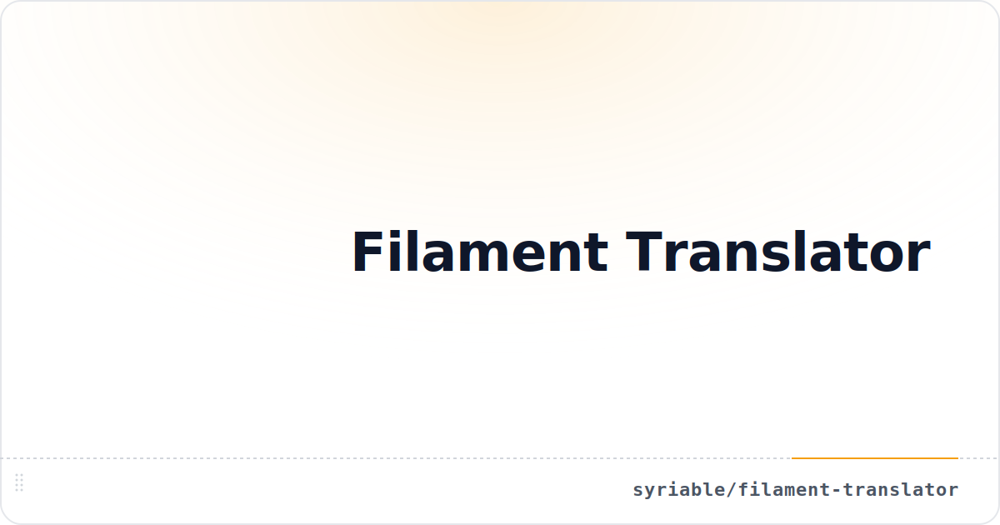

# Syriable Filament Translator

[](https://packagist.org/packages/syriable/filament-translator)
[](https://github.com/syriable/filament-translator/actions?query=workflow%3Arun-tests+branch%3Amain)
[](https://github.com/syriable/filament-translator/actions?query=workflow%3A%22Fix+PHP+code+style+issues%22+branch%3Amain)
[](LICENSE.md)

Convention-based automatic translations for [Filament](https://filamentphp.com) panels — forms, tables, actions, infolists, resources, pages, widgets, importers, and exporters.

**Syriable Filament Translator** derives translation keys from your PHP class names and Filament component names so UI code stays free of hard-coded copy. The package registers lazy label resolvers at boot; when a lang entry is missing, Filament’s default label is preserved.

## Requirements

- PHP 8.3+
- Laravel 11, 12, or 13
- Filament 4 or 5

## Installation

You can install the package via Composer:

```bash
composer require syriable/filament-translator
```

Register the plugin on your Filament panel:

```php
use Filament\Panel;
use Syriable\Filament\Plugins\Translator\TranslatorPlugin;

public function panel(Panel $panel): Panel
{
    return $panel
        ->plugins([
            TranslatorPlugin::make()
                ->pathAliases([
                    'App\\Livewire' => 'livewire',
                ]),
        ]);
}
```

The `TranslatorServiceProvider` is auto-discovered and registers `conventionKey()` macros on Filament schema components.

## Usage

### Panel plugin

`TranslatorPlugin` boots the convention registry when the panel starts. Register it on every panel that should resolve labels automatically.

### Path aliases

Map namespace fragments to lang file paths when your classes live outside Filament’s default directory structure:

```php
TranslatorPlugin::make()
    ->pathAliases([
        'App\\Livewire' => 'livewire',
    ]);

// Replace all aliases instead of merging:
TranslatorPlugin::make()
    ->pathAliases(['App\\Livewire' => 'livewire'], merge: false);
```

### Automatic key creation (local development)

Hand-writing every lang key while building an interface is tedious. Enable
`createMissingTranslationKeys()` and the package scaffolds any **missing required label** into the
correct lang file as you load pages — creating the file, the nested array path, and a humanised
default value — so you’re left with a ready-to-translate stub instead of a raw key on screen.

```php
TranslatorPlugin::make()
    ->createMissingTranslationKeys();
```

Requesting `livewire/auth/login.form.components.actions.forgot-password.label`, for example, writes
`lang/{locale}/livewire/auth/login.php`:

```php
return [
    'form' => [
        'components' => [
            'actions' => [
                'forgot-password' => [
                    'label' => 'Forgot Password',
                ],
            ],
        ],
    ],
];
```

- **Local only.** Writes are always skipped in production regardless of the flag — lang files are
  never written on live requests.
- **Required labels only.** Optional attributes (placeholder, helper text, tooltip, …) are skipped
  to keep lang files lean, and existing values are never overwritten.

Customise the seeded value, or gate activation behind a condition, with the method arguments:

```php
// Seed every new key with an empty string instead of a humanised guess:
TranslatorPlugin::make()->createMissingTranslationKeys(using: fn (string $key) => '');

// Enable only in the local environment:
TranslatorPlugin::make()->createMissingTranslationKeys(fn () => app()->isLocal());
```

### Plugin helpers

```php
TranslatorPlugin::get();      // plugin instance on the current panel
TranslatorPlugin::isActive(); // whether the plugin is registered
```

### Standalone Livewire pages

Filament schemas on guest routes still need the registry booted once:

```php
use Syriable\Filament\Plugins\Translator\ConventionRegistry;

app(ConventionRegistry::class)->registerDefaults();
```

Register `TranslatorPlugin` on a panel with `pathAliases()` when you need namespace remapping; aliases are read from the active plugin during label resolution. When the plugin is not registered on the active panel, resolution falls back to empty path aliases instead of throwing, so guest routes keep working.

## Configuration

By default only the primary attributes (`label`, section `heading`, placeholder `content`, model labels, …) are **required** — a missing translation surfaces the convention key — while attributes such as `placeholder`, `tooltip`, `helperText`, and `hint` are optional and fall back to `null`.

Publish the config file to change which attributes are required:

```bash
php artisan vendor:publish --tag="filament-translator-config"
```

`config/filament-translator.php` exposes a `required` map keyed by attribute (method) name. `true` makes the attribute required, `false` makes it optional; anything not listed keeps the default. Overrides apply across every context where the attribute appears (forms, tables, columns, filters, actions, summarizers):

```php
return [
    'required' => [
        'placeholder' => true, // require placeholders everywhere
        'tooltip' => true,     // require tooltips
        'label' => false,      // make labels optional
    ],
];
```

Required attributes also participate in [automatic key creation](#automatic-key-creation-local-development) when that feature is enabled.

### Custom schema components

Register your own schema components (extending `Filament\Schemas\Components\Component`) so their
attributes resolve through the same convention pipeline as first-party fields. Map each component
class to an `attribute => allowNull` list (`false` = required, `true` = optional), in the same
shape as the built-in attribute maps:

```php
// config/filament-translator.php
'components' => [
    \App\Filament\Schemas\Components\Separator::class => [
        'text' => false,
    ],
],
```

```php
// Used unchanged in a form…
Separator::make('or'),

// …resolved from lang/{locale}/livewire/auth/login.php:
'form' => ['components' => ['or' => ['text' => 'Or']]],
```

The `required` overrides above apply to registered attributes too, and they participate in automatic
key creation when enabled. Filament's first-party `Filament\Schemas\Components\Text` is supported out
of the box — address it with `Text::make(null)->key('or')` (or `Text::make()` content stays literal).

## What gets translated

`ConventionRegistry` wires lazy resolvers through Filament’s `configureUsing` hooks. Missing translations fall back to Filament’s native labels.

| Area                       | Translated attributes                                                                                                                                                                                              |
| -------------------------- | ------------------------------------------------------------------------------------------------------------------------------------------------------------------------------------------------------------------ |
| **Actions**                | Label, tooltip, badge, modal heading/description, submit/cancel labels, success/failure notification titles                                                                                                        |
| **Forms & infolists**      | Field labels, placeholders, helper text, hints, prefixes/suffixes, validation attributes, section headings/descriptions, wizard steps, repeater action labels, select create/edit modal headings, loading messages |
| **Tables**                 | Search placeholder, model labels, heading/description, default sort label, empty state heading/description, actions column label                                                                                   |
| **Columns**                | Label, description, tooltip, prefix/suffix, placeholder, default value, validation attribute                                                                                                                       |
| **Filters**                | Label, indicator, placeholder, true/false labels, constraint labels                                                                                                                                                |
| **Summarizers & grouping** | Label, prefix, suffix, grouping labels                                                                                                                                                                             |
| **Importers & exporters**  | Column and action labels                                                                                                                                                                                           |

> **Monitored column types.** Automatic column-label resolution is wired for `TextColumn`,
> `IconColumn`, `ColorColumn`, `ToggleColumn`, and `SelectColumn`. Custom or other column types are
> not translated automatically — set their key explicitly with the [`conventionKey()` macro](#component-macros).

Static metadata on pages, resources, clusters, widgets, relation managers, and resource pages is resolved through the `Resolves*` traits (see below).

## Translation key convention

```
{owner-path}.{context}.{component-name}.{attribute}
```

Examples:

| UI source                        | Lang key                                                                 |
| -------------------------------- | ------------------------------------------------------------------------ |
| `UserResource` form field `name` | `filament/resources/user-resource.form.name.label`                       |
| Login page action `login`        | `livewire/auth/login.actions.login.label`                                |
| Page title                       | `livewire/auth/login.title`                                              |
| Relation manager table           | `filament/resources/user-resource.relation_managers.posts.table.heading` |

Place strings under `lang/{locale}/` using nested arrays or dot keys.

### Example lang file

For a `UserResource` form with `name` and `email` fields, create
`lang/en/filament/resources/user-resource.php`:

```php
<?php

return [
    'model_label' => 'user',
    'plural_model_label' => 'users',
    'navigation_label' => 'Users',
    'navigation_group' => 'Access',

    'form' => [
        'name' => [
            'label' => 'Full name',
            'helper_text' => 'First and last name.',
        ],
        'email' => [
            'label' => 'Email address',
            'placeholder' => 'you@example.com',
        ],
    ],

    'table' => [
        'name' => ['label' => 'Name'],
        'email' => ['label' => 'Email'],
    ],
];
```

Any key you omit falls back to Filament's native label, so you only translate what you need.

## Component macros

Override or prefix translation keys on individual schema components:

```php
use Filament\Forms\Components\TextInput;
use Filament\Forms\Components\Toggle;

TextInput::make('name')
    ->conventionKey('custom.segment.name');

Toggle::make('active')
    ->conventionKey('globals.active', isAbsolute: true);
```

| Macro                       | Purpose                                              |
| --------------------------- | ---------------------------------------------------- |
| `conventionKey()`           | Set or derive the translation segment                |
| `getConventionKey()`        | Read the evaluated key                               |
| `conventionKeyAbsolute()`   | Mark the key as absolute (skip owner-path prefixing) |
| `isConventionKeyAbsolute()` | Check whether the key is absolute                    |

## Base classes

Extend Syriable’s translatable bases instead of Filament’s when you want convention-based metadata out of the box:

| Base class                         | Replaces                      |
| ---------------------------------- | ----------------------------- |
| `TranslatablePage`                 | `Filament\Pages\Page`         |
| `TranslatableResource`             | `Filament\Resources\Resource` |
| `TranslatableCluster`              | `Filament\Clusters\Cluster`   |
| `TranslatableCreateRecord`         | `CreateRecord`                |
| `TranslatableEditRecord`           | `EditRecord`                  |
| `TranslatableViewRecord`           | `ViewRecord`                  |
| `TranslatableListRecords`          | `ListRecords`                 |
| `TranslatableManageRecords`        | `ManageRecords`               |
| `TranslatableManageRelatedRecords` | `ManageRelatedRecords`        |
| `TranslatableRelationManager`      | `RelationManager`             |
| `TranslatableWidget`               | `Filament\Widgets\Widget`     |
| `TranslatableChartWidget`          | `ChartWidget`                 |
| `TranslatableTableWidget`          | `TableWidget`                 |
| `TranslatableStatsOverviewWidget`  | `StatsOverviewWidget`         |
| `TranslatableExporter`             | `Exporter`                    |
| `TranslatableImporter`             | `Importer`                    |

Example:

```php
use Syriable\Filament\Plugins\Translator\Filament\Pages\TranslatablePage;
use Syriable\Filament\Plugins\Translator\Filament\Resources\TranslatableResource;

class Login extends TranslatablePage { /* … */ }

class UserResource extends TranslatableResource { /* … */ }
```

## Traits

Use traits directly on your own classes when you prefer not to extend the base classes:

| Trait                           | Resolves                                                                        |
| ------------------------------- | ------------------------------------------------------------------------------- |
| `ResolvesPageLabels`            | Title, subheading, navigation label, navigation group                           |
| `ResolvesResourceLabels`        | Model label, plural model label, navigation label, navigation group, breadcrumb |
| `ResolvesResourcePageLabels`    | Resource page title, subheading, navigation metadata                            |
| `ResolvesRelationManagerLabels` | Relation manager title, model label, table/form/action labels                   |
| `ResolvesClusterLabels`         | Cluster navigation label and group                                              |
| `ResolvesWidgetLabels`          | Shared widget label resolution                                                  |
| `ResolvesChartWidgetLabels`     | Chart widget heading and description                                            |
| `ResolvesTableWidgetLabels`     | Table widget heading                                                            |
| `ResolvesStatsOverviewLabels`   | Stats overview heading and description                                          |
| `ResolvesExporterLabels`        | Exporter column labels                                                          |
| `ResolvesImporterLabels`        | Importer column labels                                                          |

Implement `TranslatesConventionally` when a class exposes `resolveLabel()` for custom convention lookups.

## Known limitations

- **`hintIconTooltip` requires single-argument `->hintIcon($icon)`.** The tooltip is resolved from
  the `hint_icon_tooltip` convention key, but passing a second argument to `->hintIcon($icon, $tooltip)`
  overrides it (that's Filament's behavior). Set the icon in PHP with one argument and put the string
  in lang.
- **Custom table column types** are not auto-monitored (see [What gets translated](#what-gets-translated));
  use the `conventionKey()` macro for them. Custom *schema* components can be registered — see
  [Custom schema components](#custom-schema-components).

## Architecture

| Concept        | Class / trait           | Role                                                               |
| -------------- | ----------------------- | ------------------------------------------------------------------ |
| Panel plugin   | `TranslatorPlugin`      | Registers the package on a Filament panel and holds path aliases   |
| Label registry | `ConventionRegistry`    | Wires Filament `configureUsing` hooks for actions, schemas, tables |
| Path aliases   | `ConfiguresPathAliases` | Maps namespace fragments to lang file paths                        |
| Custom keys    | `conventionKey()` macro | Override the derived key on any schema component                   |

## Testing

```bash
composer test
```

## Changelog

Please see [CHANGELOG](CHANGELOG.md) for more information on what has changed recently.

## Security Vulnerabilities

Please review [our security policy](https://github.com/syriable/filament-translator/security/policy) on how to report security vulnerabilities.

## Credits

- [Syriable](https://github.com/syriable)

## License

The MIT License (MIT). Please see [License File](LICENSE.md) for more information.
